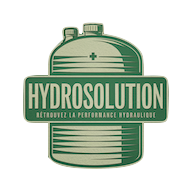

# HydroSol
E-commerce sit selling hydraulic components for Citroën cars.

Finding a workshop capable of servicing our Citroëns with hydropneumatic suspension is becoming increasingly difficult.

If we want to repair them ourselves, it can be just as difficult to find the parts needed to fix them.

This site offers to sell repair kits. Or to sell a repaired hydraulic component in exchange for a defective model.

Repair tutorials and optimized AI for workshop documentation are also available on the site.

------------------------------------------

IL est de plus en plus difficile de trouver un garagiste capable de s’occuper de nos Citroën à suspension hydropneumatique.

Si on veut réparer ses voitures nous même, il peut être tout aussi difficile de trouver les pièces de réparations.

Ce site propose de vendre des kits de réparation ou de vendre un organe hydraulique réparé en échange d’un modèle défectueux.

Ce site a aussi pour ambition de fournir des tutoriels pour effectuer vos réparations et une IA optimisées sur les documentations d’ateliers.